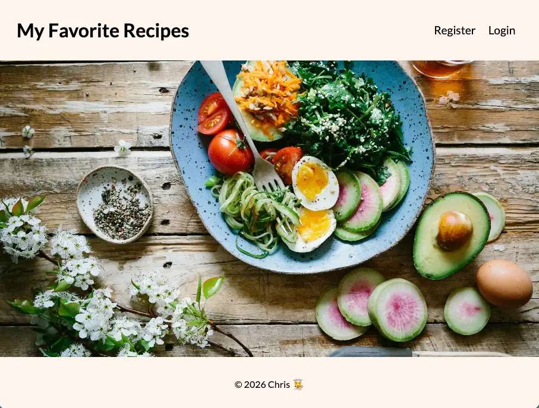

# Recipe Node App

Final project for "Node.js" course with [Code the Dream](https://codethedream.org/). Full stack recipe app built with Node, Express and MongoDB. Users can register and log in to create, save, update and delete their own favorite recipes.

## Preview



## Live Site on Render

[Recipe Node App](https://final-recipe-node-app-christina.onrender.com/)

## Github Link

[GitHub Link](https://github.com/codercreative/recipe-node-app)

## Project Setup

Clone the repository

Install dependencies:

`npm install`

In the root create an `.env` file with your own values:

```
MONGO_URI
JWT_SECRET
JWT_LIFETIME
```

To run the server:

```
npm start
```

## Tech Stack and Features

- Node.js
- Express
- MongoDB
- Mongoose
- JavaScript
